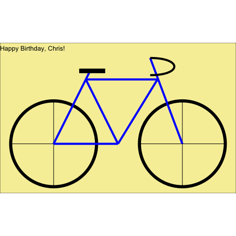

```{r}
library(tidyverse)
library(ggforce)
library(gganimate)
```

```{r, eval=FALSE}
wheel <- tibble(x = c(1, 4),
              y = c(2,2))

spoke <- tibble(x =   rep(c(1,0,4,3, 1-sin(pi/4), 1-sin(pi/4), 4-sin(pi/4), 4-sin(pi/4)),10),
               xend = rep(c(1,2,4,5, 1+sin(pi/4), 1+sin(pi/4), 4+sin(pi/4), 4+sin(pi/4)),10),
               y =    rep(c(1,2,1,2, 2-sin(pi/4), 2+sin(pi/4), 2-sin(pi/4), 2+sin(pi/4)),10),
               yend = rep(c(3,2,3,2, 2+sin(pi/4), 2-sin(pi/4), 2+sin(pi/4), 2-sin(pi/4)),10),
               group = rep(1:20, each=4))

frame <- tibble(x = c(1,1, 2.5, 4, 2.5, 1.75),
               xend = c(2.5, 1.85, 1.75, 3.25, 3.42, 3.42),
               y = c(2, 2, 2, 2, 2, 3.5),
               yend = c(2, 3.7, 3.5, 4, 3.5, 3.5))

handle <- tibble(x = c(3.25, 4, 4, 3.25),
                 y = c(4, 4, 3.6, 3.6))


ggplot(spoke) +
  geom_circle(data = wheel,
              aes(x0 = x, y0 = y, r = 1),
              size = 3) +
  geom_segment(aes(x = x, 
                   y = y,
                   xend = xend,
                   yend = yend)) +
  geom_segment(data = frame,
               aes(x = x,
                   y = y,
                   xend = xend,
                   yend = yend),
               size = 2,
               color = "blue") +
  geom_segment(aes(x = 1.6, xend = 2.2, y = 3.7, yend = 3.7), size = 4) +
  geom_bezier(data = handle,
              aes(x = x, y = y),
           size = 2) +
  coord_fixed() +
  labs(title = "Happy Birthday, Chris!") +
  theme_void() +
  theme(plot.background = element_rect(fill = "#f6efa6")) +
  transition_manual(group)

anim_save("hbd_chris.gif")
```


```{r}

```


